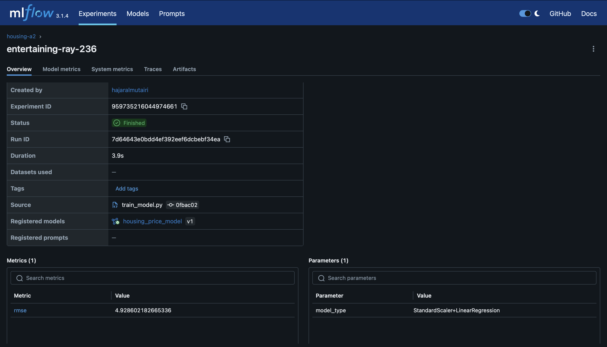

# EE P 596 – A2: Model Registry & Testing

This assignment extends A0 (training) and A1 (FastAPI service) by:
- Using **MLflow Model Registry** for the Boston Housing model
- Loading the model from the registry in **FastAPI**
- Adding **Pydantic validation**, **version metadata**, and **basic tests**

---

## Updates

- Model is registered as `housing_price_model` in MLflow (local file store)
- FastAPI `/predict`:
  - Accepts a JSON body (`HousingFeatures` Pydantic model)
  - Optional `model_version` query parameter
  - Returns `prediction` + `metadata`:
    - `app_version = "0.1.0"`
    - `model_version`
    - `prediction_datetime` (UTC)
- Added tests with `pytest` for:
  - Happy path (valid payload → 200)
  - Missing field → 422 validation error

## Screenshots

### FastAPI – `/predict` endpoint


### MLflow – housing_a2 run and registered model



---

## Structure

```text
A2/
  __init__.py
  train_model.py       # train + register housing_price_model
  main.py              # FastAPI app loading from MLflow registry
  mlflow_quickstart.py # small MLflow demo (not required)
  mlruns/              # MLflow tracking + registry data
  tests/
    test_app.py        # basic API tests
  docs/
    fastapi_predict.png
    mlflow_run.png
```
