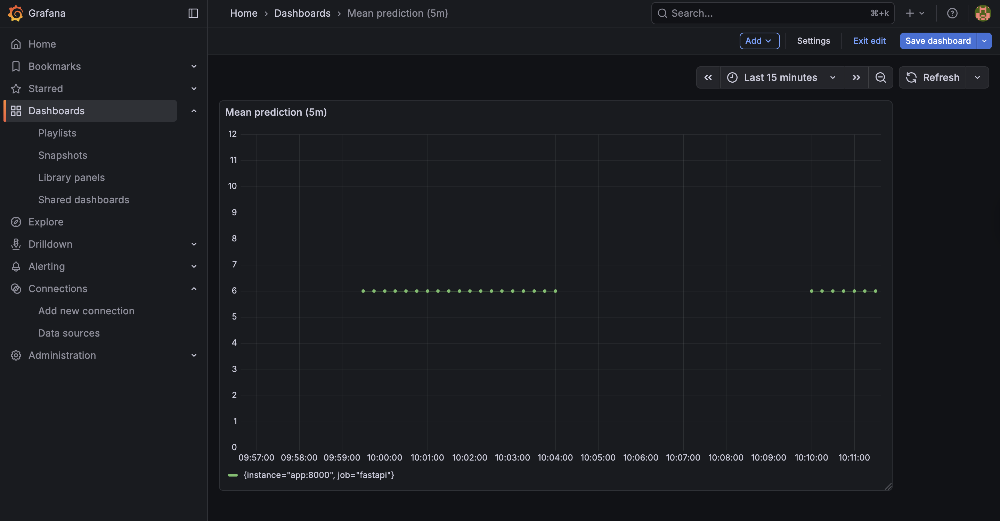
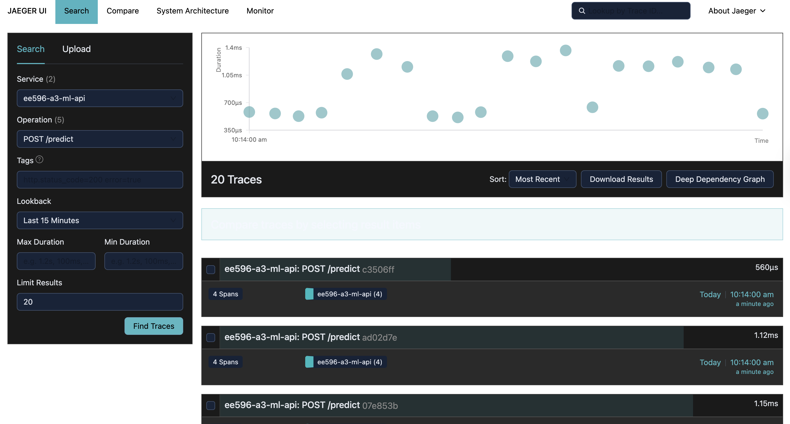

# EE596 F A3 

This assignment adds **observability** to the ML prediction API using:

- **Prometheus metrics** (including a **custom metric** for prediction values)
- **Grafana dashboard** (visualizing mean prediction over time)
- **OpenTelemetry tracing** exported to **Jaeger**
- API runs locally via Docker Compose

---

## Services & URLs (Local)

- **ML API (FastAPI)**: http://localhost:8000  
  - Swagger UI: http://localhost:8000/docs  
  - Metrics endpoint: http://localhost:8000/metrics
- **Prometheus**: http://localhost:9090
- **Grafana**: http://localhost:3000
- **Jaeger**: http://localhost:16686

## Screenshots

### Grafana dashboard 

### Prometheus showing custom metric

### Jaeger traces 

### Swagger UI 

